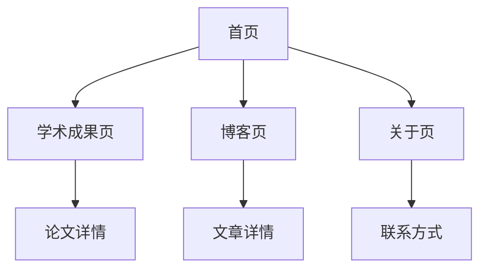

## 1. Product Overview

This is a modern personal academic homepage website, adopting a design style similar to tianxingchen.github.io, providing a professional personal showcase platform for scholars and researchers. The product mainly addresses scholars' needs to display personal profiles, academic achievements, and research blogs online, helping to establish a professional academic network image.

Target users are academic groups such as scholars, researchers, and PhD students, highlighting academic professionalism through clean and elegant design.

## 2. Core Features

### 2.1 User Roles
This is a personal showcase website that does not require user registration or login system. Visitors can browse all content directly.

### 2.2 Feature Module

The website includes the following core pages:

1. **Home Page**: Personal profile, avatar, contact information, quick navigation
2. **Publications Page**: Paper list, project showcase, research achievement details
3. **Blog Page**: Article list, article details, category tags
4. **About Page**: Detailed introduction, educational background, research interests

### 2.3 Page Details

| Page Name | Module Name | Feature Description |
|-----------|-------------|-------------------|
| Home Page | Personal Profile Section | Display avatar, name, position, institution, brief self-introduction |
| Home Page | Social Media Links | Provide links to academic social platforms like GitHub, Google Scholar, email |
| Home Page | Quick Navigation | Provide quick jump links to main pages |
| Publications Page | Paper List | List all academic papers in reverse chronological order, including title, authors, journal/conference, year |
| Publications Page | Paper Details | Click on paper to view detailed information including abstract, keywords, citation info |
| Publications Page | Project Showcase | Display participated research projects including project name, time, introduction, related links |
| Blog Page | Article List | List all blog articles in reverse chronological order by publication time, showing title, abstract, publication time |
| Blog Page | Article Categories | Filter articles by category or tags |
| Blog Page | Article Details | Display complete blog article content, support Markdown format |
| About Page | Detailed Introduction | Complete educational background, work experience, research interests, awards |
| About Page | Contact Information | Provide email, office address and other contact information |

## 3. Core Process

Visitor browsing flow:
1. Visit homepage to understand basic information and academic background
2. Click navigation to publications page to view papers and projects
3. Enter blog page to read academic articles and insights
4. View about page to get detailed contact information

## 4. 用户界面设计

### 4.1 Design Style
- **Primary Colors**: Deep blue (#1e3a8a) and white, reflecting academic rigor
- **Secondary Colors**: Light gray (#f8fafc) for backgrounds, dark gray (#374151) for text
- **Button Style**: Flat design with rounded corners and hover effects
- **Typography**: Palatino font family ('Palatino Linotype', 'Book Antiqua', Palatino, serif) for all text to maintain academic style, headings 18-24px, body text 16px
- **Layout Style**: Responsive card layout with sidebar navigation on the left and content area on the right
- **Icon Style**: Minimalist linear icons to maintain academic professionalism

### 4.2 Page Design Overview

| Page Name | Module Name | UI Elements |
|-----------|-------------|-------------|
| Home Page | Personal Profile Section | Circular avatar 150px, name uses 24px bold font, position uses 18px regular font, institution uses 16px gray font |
| Home Page | Social Media Links | Horizontally arranged circular icons, each 40px size, color change effect on hover |
| Publications Page | Paper List | Card-based design, each card contains title (18px bold), authors (14px gray), journal (16px blue), year (14px gray) |
| Blog Page | Article List | Clean list design, title uses 18px font, abstract uses 14px gray font, time uses 12px font |
| About Page | Detailed Introduction | Section-based layout, each section has clear headings, appropriate line spacing and paragraph spacing |

### 4.3 Responsiveness
- Desktop-first design, minimum width 1200px
- Tablet adaptation: 768px-1199px, sidebar becomes top navigation
- Mobile adaptation: less than 768px, adopts single-column layout, navigation becomes hamburger menu
- Touch interaction optimization: button and link areas minimum 44px, supports touch swipe

## 5. Content Management

- Personal profile data stored in JSON files for easy updates and maintenance
- Academic achievement data uses structured JSON format containing complete paper metadata
- Blog articles use Markdown format, supporting code highlighting and mathematical formulas
- All content files use version control for tracking modification history