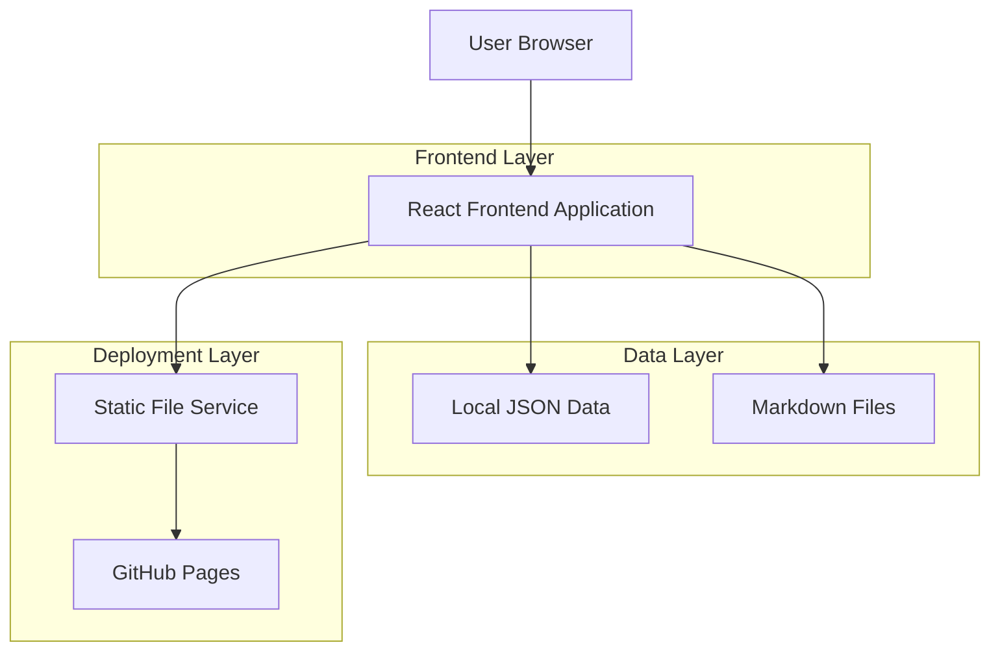

## 1. Architecture Design



## 2. Technology Description

- **Frontend**: React@18 + Tailwind CSS@3 + Vite
- **Initialization Tool**: vite-init
- **Backend**: None (Static Site Generation)
- **Deployment**: GitHub Pages
- **Dependency Management**: npm/yarn

## 3. Route Definitions

| Route | Purpose |
|-------|---------|
| / | Homepage, displays personal profile and quick navigation |
| /publications | Publications page, displays papers and project list |
| /blog | Blog page, displays article list |
| /blog/:slug | Article detail page, displays single blog content |
| /about | About page, displays detailed information |

## 4. Project Structure

```
src/
├── components/          # Reusable components
│   ├── Header.jsx      # Website header navigation
│   ├── Footer.jsx      # Website footer
│   ├── PublicationCard.jsx  # Paper card component
│   ├── BlogPostCard.jsx     # Blog post card
│   └── SocialLinks.jsx      # Social media links
├── pages/              # Page components
│   ├── Home.jsx        # Homepage
│   ├── Publications.jsx # Publications page
│   ├── Blog.jsx        # Blog list page
│   ├── BlogPost.jsx    # Blog detail page
│   └── About.jsx       # About page
├── data/               # Static data
│   ├── profile.json    # Personal profile data
│   ├── publications.json # Paper data
│   └── projects.json   # Project data
├── posts/              # Markdown blog posts
│   ├── hello-world.md
│   └── another-post.md
├── styles/             # Style files
│   └── globals.css     # Global styles
├── utils/              # Utility functions
│   ├── markdown.js     # Markdown parsing utility
│   └── dateFormat.js   # Date formatting
└── App.jsx             # Main application component
```

## 5. Data Model

### 5.1 Personal Profile Data Structure

```json
{
  "name": "John Doe",
  "title": "PhD Student",
  "institution": "University of Computer Science",
  "bio": "Focused on artificial intelligence and machine learning research...",
  "avatar": "/images/avatar.jpg",
  "email": "john.doe@example.com",
  "social": {
    "github": "https://github.com/johndoe",
    "googleScholar": "https://scholar.google.com/citations?user=xxx",
    "linkedin": "https://linkedin.com/in/johndoe",
    "twitter": "https://twitter.com/johndoe"
  },
  "education": [
    {
      "degree": "PhD",
      "school": "University Name",
      "year": "2020-2024",
      "field": "Computer Science and Technology"
    }
  ]
}
```

### 5.2 Paper Data Structure

```json
[
  {
    "id": 1,
    "title": "Example Paper Title",
    "authors": ["John Doe", "Jane Smith", "Bob Wilson"],
    "venue": "Nature Machine Intelligence",
    "year": 2024,
    "abstract": "This paper proposes a new...",
    "keywords": ["Machine Learning", "Deep Learning"],
    "links": {
      "pdf": "/files/paper1.pdf",
      "code": "https://github.com/johndoe/project1",
      "project": "https://project1.github.io"
    },
    "highlight": true
  }
]
```

### 5.3 Blog Article Data Structure

```markdown
---
title: "Blog Article Title"
date: "2024-01-15"
category: "Technical Sharing"
tags: ["React", "Frontend Development"]
---

This is the main content of the blog article, supporting Markdown format.

## Secondary Heading

- List item 1
- List item 2

```code block example```
```

## 6. Core Dependencies

```json
{
  "dependencies": {
    "react": "^18.2.0",
    "react-dom": "^18.2.0",
    "react-router-dom": "^6.8.0",
    "react-markdown": "^8.0.0",
    "remark-gfm": "^3.0.0",
    "date-fns": "^2.29.0"
  },
  "devDependencies": {
    "@vitejs/plugin-react": "^3.1.0",
    "vite": "^4.1.0",
    "tailwindcss": "^3.2.0",
    "autoprefixer": "^10.4.0",
    "postcss": "^8.4.0"
  }
}
```

## 7. Deployment Configuration

### 7.1 GitHub Actions Workflow

```yaml
name: Deploy to GitHub Pages
on:
  push:
    branches: [ main ]
jobs:
  build-and-deploy:
    runs-on: ubuntu-latest
    steps:
    - uses: actions/checkout@v3
    - name: Setup Node.js
      uses: actions/setup-node@v3
      with:
        node-version: '18'
    - name: Install dependencies
      run: npm ci
    - name: Build
      run: npm run build
    - name: Deploy to GitHub Pages
      uses: peaceiris/actions-gh-pages@v3
      with:
        github_token: ${{ secrets.GITHUB_TOKEN }}
        publish_dir: ./dist
```

### 7.2 Vite配置

```javascript
import { defineConfig } from 'vite'
import react from '@vitejs/plugin-react'

export default defineConfig({
  plugins: [react()],
  base: '/',
  build: {
    outDir: 'dist',
    assetsDir: 'assets'
  }
})
```

## 8. Development Scripts

```json
{
  "scripts": {
    "dev": "vite",
    "build": "vite build",
    "preview": "vite preview",
    "deploy": "npm run build && gh-pages -d dist"
  }
}
```